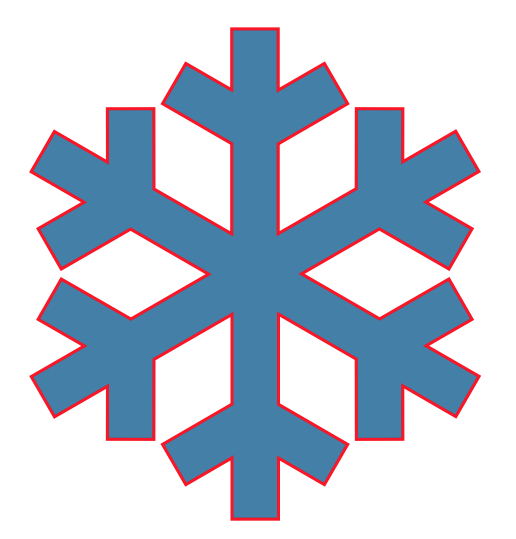

# Snowflake

[](https://travis-ci.org/onmyway133/Snowflake)
[](http://cocoadocs.org/docsets/Snowflake)
[](https://github.com/Carthage/Carthage)
[](http://cocoadocs.org/docsets/Snowflake)
[](http://cocoadocs.org/docsets/Snowflake)


## Description

- SVG in Swift
- Use XML parser from [Reindeer](https://github.com/onmyway133/Reindeer)

## Usage

### Document

- Create a `Document` with SVG `Data`

```swift
guard let path = Bundle.main.path(forResource: item, ofType: "svg"),
  let data = try? Data(contentsOf: URL(fileURLWithPath: path)),
   let document = Snowflake.Document(data: data)
 else { return }

let view = document.svg.view
```

- The flow is `SVG element` -> `Shape` -> `CALayer`

### Shapes

<div align = "center">

<br>
</div>

- The `Shape` object maps to SVG elements
	- path: `PathShape`
	- circle: `Circle`
	- line: `Line`
	- polygon: `Polygon`
	- polyline: `Polyline`
	- rect: `Rectangle`
	- ellipse: `Ellipse`
	- text: `Text`
	- image: `Image`

- `PathShape` handles list of commands through `Command` object

### Style

- The `Style` object encapsulates style information
	
<div align = "center">

<br>
</div>

- Inner style

```xml
<polygon points="100,10 40,198 190,78 10,78 160,198" fill="lime" stroke="purple" stroke-width="5" fill-rule="evenodd" />
```

- Style attribute

```xml
<polygon points="100,10 40,198 190,78 10,78 160,198" style="fill:lime;stroke:purple;stroke-width:5;fill-rule:evenodd;" />
```

### Animation

- The cool thing about `CALayer` is that most of its properties are animatable

```swift
let layer = PathShape().layer
let animator = Animator()
animator.animate(layer: layer)
```

<div align = "center">

<br>
</div>

### Scale

- TBD

### Pattern

- TBD

## Installation

**Snowflake** is available through [CocoaPods](http://cocoapods.org). To install
it, simply add the following line to your Podfile:

```ruby
pod 'Reindeer', git: 'https://github.com/onmyway133/Reindeer'
pod 'Snowflake', git: 'https://github.com/onmyway133/Snowflake'
```

**Snowflake** is also available through [Carthage](https://github.com/Carthage/Carthage).
To install just write into your Cartfile:

```ruby
github "onmyway133/Snowflake"
```

**Snowflake** can also be installed manually. Just download and drop `Sources` folders in your project.

## Author

Khoa Pham, onmyway133@gmail.com

## Contributing

We would love you to contribute to **Snowflake**, check the [CONTRIBUTING](https://github.com/onmyway133/Snowflake/blob/master/CONTRIBUTING.md) file for more info.

## License

**Snowflake** is available under the MIT license. See the [LICENSE](https://github.com/onmyway133/Snowflake/blob/master/LICENSE.md) file for more info.
