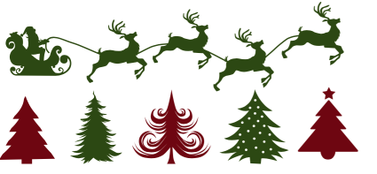
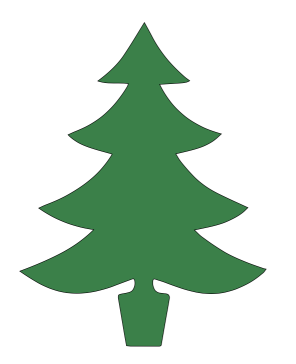
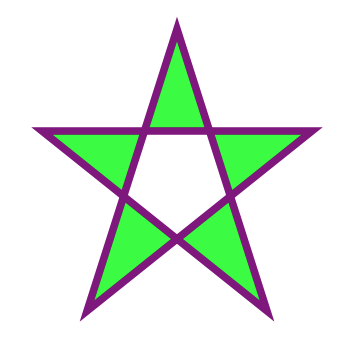
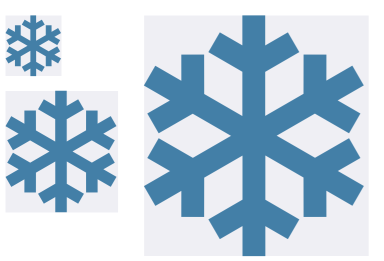

# Snowflake

[](http://cocoadocs.org/docsets/Snowflake)
[](https://github.com/Carthage/Carthage)
[](http://cocoadocs.org/docsets/Snowflake)
[](http://cocoadocs.org/docsets/Snowflake)


## Description

- SVG in Swift
- Use XML parser from [Reindeer](https://github.com/onmyway133/Reindeer)

## Usage

### Document

- Create a `Document` with SVG `Data`

```swift
guard let path = Bundle.main.path(forResource: "xmas", ofType: "svg"),
  let data = try? Data(contentsOf: URL(fileURLWithPath: path)),
   let document = Snowflake.Document(data: data)
 else { return }

let view = document.svg.view(size: CGSize(width: 100, height: 100))
```

<div align = "center">

<br>
</div>

- The flow is `SVG element` -> `Shape` -> `UIBezierPath` -> `CALayer`
- Make `Shape` from attributes

```swift
let attributes: [String: Any] = [
  "fill": "#358245",
  "stroke": "black",
  "stroke-miterlimit": "10",
  "d": "M308.3,102.3c4.5,8.2,9,16.2,13.2,24.3c7.2,13.9,15.8,26.9,25.6,39c10.1,12.4,21.5,23.6,33.6,34.1c2.5,2.1,5.2,3.9,8.1,6c-5.1,3.5-11.2,3.8-17,4.2c-11.9,0.9-23.7,1.5-36.4,2.3c22.7,46.7,59.7,74.6,109.7,88.1c-4.2,3.8-7.7,7.4-11.7,10.4c-11.3,8.6-24.4,13.7-38,17.4c-10.1,2.8-20.3,5-31.3,7.7c3.2,5,5.8,10.2,9.5,14.7c6.9,8.5,14.1,16.9,21.7,24.7c12.5,12.9,27.3,23,43.2,31c17.5,8.8,35.5,16.7,53.8,25.2c-3.4,3.1-6.9,7.1-11.2,10.1c-17,12.1-36.1,19.4-56.4,23.8c-8.7,1.9-17.3,3.7-27.5,5.8c5,4.7,9,9.2,13.7,12.6c13.2,9.4,26.4,19,40.4,27.1c11.8,6.9,24.6,12.1,37.3,17.4c10.4,4.3,21.1,7.7,31.7,11.5c1.1,0.4,2.3,0.5,4.4,0.9c-2.1,2.6-3.5,5.3-5.7,7c-6.7,5.3-13.2,10.8-20.5,15.1c-14.8,8.7-30.5,15.6-47.5,19.2c-17.8,3.8-35.6,3.1-53.3-0.8c-18.1-3.9-35.4-10.3-52.6-16.8c-5.7-2.2-11.7-3.7-17.5-5.8c-2.8-1-3.9,0.1-4.2,2.7c-1.1,11.3,2.7,22.1,15.6,22.4c2,0.1,3.9,0.6,5.9,0.7c6,0.3,8.7,3.1,7.7,9.1c-2,12.5-4.4,25-6.6,37.6c-2.6,14.6-5.1,29.2-7.6,43.8c-0.3,2-1.1,2.9-3.3,2.9c-17.2-0.1-34.4,0-51.6-0.1c-2.2,0-4.4-0.5-7-0.7c-1.2-6.4-2.4-12.8-3.5-19.2c-3.5-20.7-7-41.3-10.5-62c-1.8-10.5-1-9.6,8.8-11.5c4.4-0.8,9.1-1.5,13.1-3.5c5.8-2.9,8.8-15.1,6.1-21.1c-1-2.3-2.4-1.9-4.1-1.3c-10.5,3.9-21.1,7.8-31.6,11.8c-20.4,7.7-41.2,12.9-63.3,13.6c-26.3,0.8-49.9-6.4-72.4-18.8c-11.1-6.2-21.7-13.3-32.3-20.6c47.5-18,93.7-37,131.4-73.8c-35.8-5.2-68-17.1-97.8-38.3c5.2-2.4,9.3-4.5,13.6-6.1c26.2-9.7,50.5-23,72.6-40c17.5-13.4,32.1-29.6,43.7-48.5c0.3-0.4,0.4-0.9,0.6-1.5c-13.9-4-27.8-7.4-41.3-12.1c-13.5-4.7-26.3-11-37.1-22.2c4.8-2.1,9.1-4.3,13.5-6c19.2-7.5,36.9-17.5,52.4-31.2c15.1-13.4,27.5-29.1,38.1-46.2c0.7-1.1,1.3-2.3,1.9-3.5c0.5-1.2,1-2.4,1.5-3.9c-17.9-2.9-36.2,1.7-54.4-4.8c18.9-13.7,34.9-28.9,47.3-47.3C285.1,140.7,296.2,121.7,308.3,102.3z"
]

let path = Path(attributes: attributes)
let layer = path.layer
```

<div align = "center">

<br>
</div>

### Shapes

- The `Shape` object maps to SVG elements
	- path: `Path`
	- circle: `Circle`
	- line: `Line`
	- polygon: `Polygon`
	- polyline: `Polyline`
	- rect: `Rectangle`
	- ellipse: `Ellipse`
	- text: `Text`
	- image: `Image`

- `Path` handles list of commands through `Command` object

### Style

- The `Style` object encapsulates style information

```swift
let attributes: [String: Any] = [
  "fill": "lime",
  "stroke": "purple",
  "stroke-width": "5",
  "fill-rule": "evenodd"
]

let style = Style(attributes: attributes)
```

- Inner style

```xml
<polygon points="100,10 40,198 190,78 10,78 160,198" fill="lime" stroke="purple" stroke-width="5" fill-rule="evenodd" />
```

- Style attribute

```xml
<polygon points="100,10 40,198 190,78 10,78 160,198" style="fill:lime;stroke:purple;stroke-width:5;fill-rule:evenodd;" />
```

<div align = "center">

<br>
</div>

### Animation

- The cool thing about `CALayer` is that most of its properties are animatable

```swift
(svgView.layer.sublayers as? [CAShapeLayer])?.forEach { layer in
  let stroke = CABasicAnimation(keyPath: "strokeEnd")
  stroke.fromValue = 0
  stroke.toValue = 1
  stroke.duration = 3

  layer.add(stroke, forKey: nil)
}
```

<div align = "center">

<br>
</div>

### Scale

- Scale layers to a given size

```swift
let layers = document.svg.layers(size: CGSize(width: 200, height: 100))
```

- Scale view to a given size

```swift
let view = document.svg.view(size: CGSize(width: 100, height: 100))
```

<div align = "center">

<br>
</div>

### Text

- TBD

### Image

- Support base64 [Data URI](https://en.wikipedia.org/wiki/Data_URI_scheme)

```swift
let attributes: [String: Any] = [
  "x": "0",
  "y": "y",
  "width": "100",
  "height": "100",
  "href": "data:image/png;base64,..."
]

let image = Image(attributes: attributes)
```

### Pattern

- TBD

## Installation

**Snowflake** is available through [CocoaPods](http://cocoapods.org). To install
it, simply add the following line to your Podfile:

```ruby
pod 'Snowflake', git: 'https://github.com/onmyway133/Snowflake'
```

or 

```ruby
pod 'FantasticSnowflake'
```

**Snowflake** is also available through [Carthage](https://github.com/Carthage/Carthage).
To install just write into your Cartfile:

```ruby
github "onmyway133/Snowflake"
```

**Snowflake** can also be installed manually. Just download and drop `Sources` folders in your project.

## Author

Khoa Pham, onmyway133@gmail.com

## Contributing

We would love you to contribute to **Snowflake**, check the [CONTRIBUTING](https://github.com/onmyway133/Snowflake/blob/master/CONTRIBUTING.md) file for more info.

## License

**Snowflake** is available under the MIT license. See the [LICENSE](https://github.com/onmyway133/Snowflake/blob/master/LICENSE.md) file for more info.
